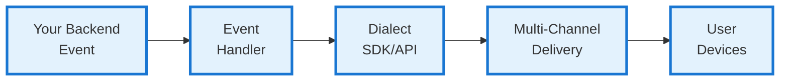

If you already have event detection in your backend (webhooks, database triggers, custom monitoring, existing alerting systems), you can integrate Dialect's alert sending directly into your existing workflows. This approach leverages your current infrastructure while adding Dialect's multi-channel notification capabilities.

<Info>
**When to Use This Approach**
- ✅ You have existing event detection systems
- ✅ You have custom business logic for notifications  
- ✅ You prefer to control when and how events are detected
- ✅ Your events are primarily off-chain or custom patterns
- ✅ You want to integrate with existing backend services

**Alternative:** If you need event detection, check out [Dialect Monitor](/alerts/alerts-and-monitoring/setup-event-detection) for automated monitoring solutions.
</Info>

## Integration Overview

The integration process involves two main steps:

1. **Configure Dialect SDK/API** in your backend services
2. **Send notifications** at the point of events in your application

## Choose Your Integration Method

### Option 1: TypeScript SDK (Recommended)

Best for Node.js/TypeScript backends. Provides type safety and simplified API.

**Setup & Configuration:**

Follow our complete [SDK Setup & Configuration guide](/alerts/send/sdk/setup-configuration) for installation, app registration, and initialization.

**Send Messages:**

Use our [SDK Send Messages guide](/alerts/send/sdk/send-messages) for comprehensive examples including:
- Single user notifications
- Batch notifications to multiple users
- Channel-specific delivery (email, Telegram, push)
- Interactive notifications with action buttons
- Rich content and formatting

### Option 2: REST API

Best for non-JavaScript backends or custom integrations.

**Setup & Configuration:**

Follow our complete [API Authentication guide](/alerts/send/api/authentication) for API key setup and request authentication.

**Send Messages:**

Use our [API Send Messages guide](/alerts/send/api/send-messages) for comprehensive examples including:
- Individual and batch messaging
- Channel targeting
- Rich HTML content for emails
- Interactive notifications with actions

## Real-World Integration Examples

**[Realms Governance API](https://github.com/dialectlabs/governance-api)**
- **Use case**: Powers notifications for post and comment upvotes and replies on [Realms Discover](https://app.realms.today/discover)
- **Implementation**: Direct backend integration using Dialect SDK within NestJS architecture
- **Features**: Event-driven notifications from existing services, custom business logic integration

**[Realms Monitoring Service](https://github.com/dialectlabs/realms-monitoring-service)**
- **Use case**: DAO proposal and governance event monitoring
- **Implementation**: Dialect Monitor integration for automated event detection
- **Features**: Proposal tracking, voting reminders, and governance event notifications

**[Jet Protocol](https://github.com/dialectlabs/jet-monitoring-service)**
- **Use case**: Liquidation warnings for DeFi lending positions
- **Implementation**: Monitoring service with backend integration patterns
- **Features**: Threshold-based notifications and risk management alerts

**[Marinade Finance](https://github.com/dialectlabs/marinade-monitoring-service)**
- **Use case**: Staking protocol notifications and updates
- **Implementation**: Backend integration with broadcast messaging features
- **Features**: Multi-user notifications and staking event detection

**[Saber](https://github.com/dialectlabs/saber-monitoring-service)**
- **Use case**: Trading and AMM protocol notifications
- **Implementation**: Push-type data sources with multi-channel delivery
- **Features**: Real-time trading alerts and cross-platform integration

**[Investin](https://github.com/dialectlabs/investin-monitoring-service)**
- **Use case**: Investment platform with multiple notification types
- **Implementation**: Complex backend with various notification triggers
- **Features**: Portfolio alerts, investment opportunities, and user engagement
