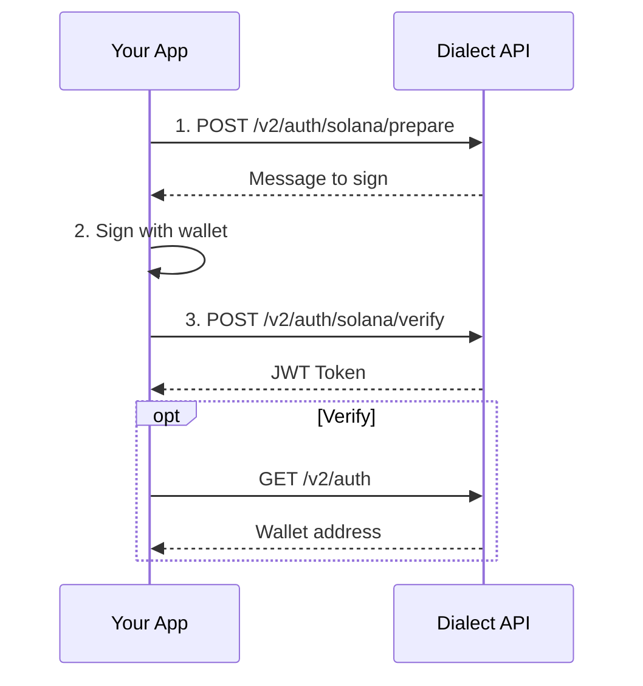

## Prerequisites

Before implementing authentication, ensure you have:

- **App Registration**: Your app must be registered with Dialect ([registration guide](/alerts/setup/register-app))
- **Client Key**: Your Dialect client key (format: `dk_...`)

## Authentication Overview

Dialect uses a two-part authentication system for inbox integration:

1. **Client Key** (`X-Dialect-Client-Key`): Identifies your application
2. **JWT Token** (`Authorization: Bearer`): Authenticates the user via wallet signature

The authentication flow involves:
1. **Prepare**: Generate a message/transaction for the user to sign
2. **Sign**: User signs with their wallet
3. **Verify**: Exchange the signature for a JWT token
4. **Use**: Include the JWT token in subsequent API calls

### Flow diagram



## Code examples

### Step 1: Prepare Authentication

Request a message for the user to sign:

<CodeGroup>
```typescript TypeScript
const prepareResponse = await fetch('https://alerts-api.dial.to/v2/auth/solana/prepare', {
  method: 'POST',
  headers: {
    'X-Dialect-Client-Key': 'YOUR_CLIENT_KEY',
    'Content-Type': 'application/json'
  },
  body: JSON.stringify({
    walletAddress: 'USER_WALLET_ADDRESS'
  })
});

const { message } = await prepareResponse.json();
// Returns: { message: "Sign this message to authenticate. Nonce: 1638471298347" }
```

```bash cURL
curl -X POST https://alerts-api.dial.to/v2/auth/solana/prepare \
  -H "X-Dialect-Client-Key: YOUR_CLIENT_KEY" \
  -H "Content-Type: application/json" \
  -d '{"walletAddress": "USER_WALLET_ADDRESS"}'
```
</CodeGroup>

### Step 2: Sign Message

Have the user sign the message with their wallet:

```typescript
// Using @solana/wallet-adapter
import { useWallet } from '@solana/wallet-adapter-react';

const { signMessage, publicKey } = useWallet();

const encodedMessage = new TextEncoder().encode(message);
const signature = await signMessage(encodedMessage);
const signatureBase58 = bs58.encode(signature);
```

### Step 3: Verify & Get JWT

Exchange the signature for a JWT token:

<CodeGroup>
```typescript TypeScript
const verifyResponse = await fetch('https://alerts-api.dial.to/v2/auth/solana/verify', {
  method: 'POST',
  headers: {
    'X-Dialect-Client-Key': 'YOUR_CLIENT_KEY',
    'Content-Type': 'application/json'
  },
  body: JSON.stringify({
    message: message,
    signature: signatureBase58
  })
});

const { token } = await verifyResponse.json();
// Store this JWT token for subsequent API calls
```

```bash cURL
curl -X POST https://alerts-api.dial.to/v2/auth/solana/verify \
  -H "X-Dialect-Client-Key: YOUR_CLIENT_KEY" \
  -H "Content-Type: application/json" \
  -d '{"message": "SIGNED_MESSAGE", "signature": "SIGNATURE_BASE58"}'
```
</CodeGroup>

## Making Authenticated Requests

You've setup the authentication flow. From now on, you can send requests to the API. Include both headers in all subsequent API calls:

```typescript
const response = await fetch('https://alerts-api.dial.to/v2/history', {
  headers: {
    'Authorization': `Bearer ${jwtToken}`,
    'X-Dialect-Client-Key': 'YOUR_CLIENT_KEY'
  }
});
```