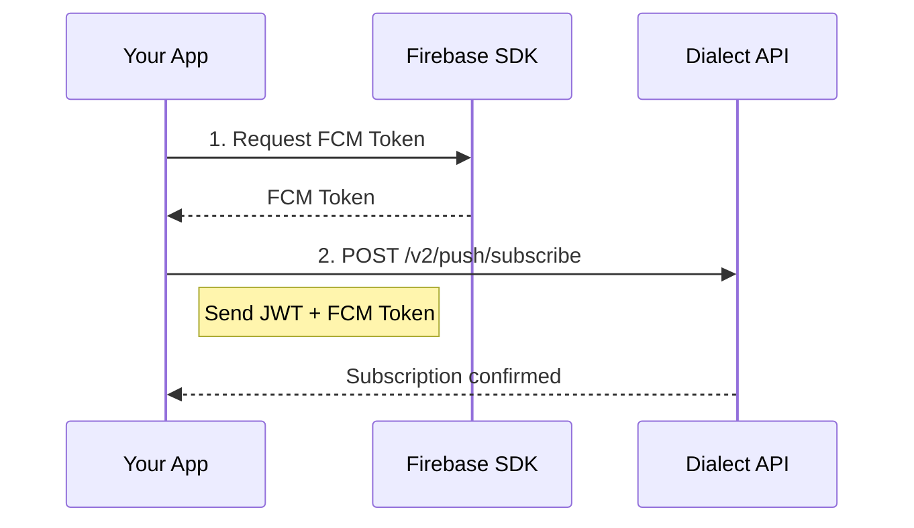

## How Push Notifications Work with Dialect

<Steps>

  <Step title="Users subscribe">
    <Note>
      Please note that it is requried to subscribe your user to the [basic alerts endpoint](/api-reference/integrate-an-inbox/subscribe-to-alerts) as well to ensure push notifications are delivered.
    </Note>
    
    Users subscribe to push notifications via your app or notification components via the [push notification endpoint](/api-reference/integrate-an-inbox/subscribe-to-push-notifications).
    
  </Step>

  <Step title="Dialect routes notifications">

    If event occurs, Dialect sends notifications to subscribed users and triggers the send process

  </Step>

  <Step title="Firebase Cloud Messaging (FCM) sends notifications">

    Firebase handles device token management and delivers push notifications to the user's device

  </Step>

</Steps>

## Prerequisites

Before implementing push notifications with Dialect, please ensure you have completed the following steps:

1. **App Registration**: Your app must be registered with Dialect ([registration guide](/alerts/setup/register-app))
2. **User Authentication**: Users must be authenticated with JWT tokens ([authentication guide](/alerts/integrate-inbox/api/authentication))
3. **Set up Firebase Cloud Messaging** in your application
   - Follow [Firebase's documentation](https://firebase.google.com/docs/cloud-messaging) to add the Firebase SDK to your app
   - Implement the necessary code to request and receive an FCM token
4. **Implement wallet integration** for Solana signature verification
   - Your mobile app must be able to request message signing from the user's wallet
5. **Provide Service Account Credentials** to Dialect for authentication
   - Dialect uses your service account credentials to authenticate and send push notifications to your users
   - To get started, create a service account with the `cloudmessaging.messages.create` rights
   - Once created, [contact Dialect support](https://form.typeform.com/to/aLMntdWJ?utm_source=docs&utm_medium=push_notifications&utm_campaign=service_account_setup&utm_content=prerequisites) to provide your service account credentials
   - Dialect will then connect your app with our Alerts infrastructure 

Once these prerequisites are in place, you can proceed with the subscription and notification flows.

## Push Subscription Flow

Once a user is authenticated, you can register their device to receive push notifications. This involves obtaining an FCM token and associating it with the user's wallet address.



## Get FCM Token

Before you can subscribe to push notifications, you need to obtain an FCM token from Firebase:

<Tabs>
<Tab title="React Native">

```typescript
import messaging from '@react-native-firebase/messaging';

async function getFCMToken() {
  try {
    // Request permission (iOS)
    const authStatus = await messaging().requestPermission();
    const enabled =
      authStatus === messaging.AuthorizationStatus.AUTHORIZED ||
      authStatus === messaging.AuthorizationStatus.PROVISIONAL;

    if (enabled) {
      // Get FCM token
      const fcmToken = await messaging().getToken();
      console.log('FCM Token:', fcmToken);
      return fcmToken;
    }
  } catch (error) {
    console.error('Failed to get FCM token:', error);
  }
}
```

</Tab>
<Tab title="iOS (Swift)">

```swift
import Firebase

func getFCMToken() {
  Messaging.messaging().token { token, error in
    if let error = error {
      print("Error fetching FCM registration token: \(error)")
    } else if let token = token {
      print("FCM registration token: \(token)")
      // Use this token to subscribe to Dialect push notifications
    }
  }
}
```

</Tab>
<Tab title="Android (Kotlin)">

```kotlin
import com.google.firebase.messaging.FirebaseMessaging

fun getFCMToken() {
  FirebaseMessaging.getInstance().token.addOnCompleteListener { task ->
    if (!task.isSuccessful) {
      Log.w(TAG, "Fetching FCM registration token failed", task.exception)
      return@addOnCompleteListener
    }

    // Get new FCM registration token
    val token = task.result
    Log.d(TAG, "FCM Token: $token")
    // Use this token to subscribe to Dialect push notifications
  }
}
```

</Tab>
<Tab title="Web">

```javascript
import { getMessaging, getToken } from 'firebase/messaging';

async function getFCMToken() {
  const messaging = getMessaging();
  try {
    const currentToken = await getToken(messaging, {
      vapidKey: 'YOUR_VAPID_KEY'
    });
    if (currentToken) {
      console.log('FCM Token:', currentToken);
      return currentToken;
    } else {
      console.log('No registration token available.');
    }
  } catch (err) {
    console.log('An error occurred while retrieving token. ', err);
  }
}
```

</Tab>
</Tabs>

For more detailed implementation instructions, visit the Firebase Cloud Messaging documentation for [iOS](https://firebase.google.com/docs/cloud-messaging/ios/client), [Android](https://firebase.google.com/docs/cloud-messaging/android/client), and [Web](https://firebase.google.com/docs/cloud-messaging/js/client).

## Push Subscription Management

### Subscribe to Push Notifications

Once you have an FCM token, subscribe the user to push notifications:

```typescript
async function subscribeToDialectPush(fcmToken: string, jwtToken: string, clientKey: string) {
  try {
    const response = await fetch('https://alerts-api.dial.to/v2/push/subscribe', {
      method: 'POST',
      headers: {
        'Authorization': `Bearer ${jwtToken}`,
        'X-Dialect-Client-Key': clientKey,
        'Content-Type': 'application/json'
      },
      body: JSON.stringify({
        fcmToken: fcmToken,
        deviceId: 'unique-device-identifier', // Optional but recommended
        appId: 'YOUR_APP_ID' // Optional - for app-specific subscriptions
      })
    });

    if (response.ok) {
      console.log('Successfully subscribed to push notifications');
    } else {
      console.error('Failed to subscribe to push notifications');
    }
  } catch (error) {
    console.error('Push subscription error:', error);
  }
}
```

**Parameters:**
- `fcmToken`: Firebase Cloud Messaging token from your mobile app
- `deviceId`: (Optional) Unique device identifier for managing devices
- `appId`: (Optional) Subscribe to pushes for specific app only

### Unsubscribe from Push Notifications

```typescript
async function unsubscribeFromDialectPush(fcmToken: string, jwtToken: string, clientKey: string) {
  try {
    const response = await fetch('https://alerts-api.dial.to/v2/push/unsubscribe', {
      method: 'POST',
      headers: {
        'Authorization': `Bearer ${jwtToken}`,
        'X-Dialect-Client-Key': clientKey,
        'Content-Type': 'application/json'
      },
      body: JSON.stringify({
        fcmToken: fcmToken,
        deviceId: 'unique-device-identifier', // Should match subscription
        appId: 'YOUR_APP_ID' // Optional
      })
    });

    if (response.ok) {
      console.log('Successfully unsubscribed from push notifications');
    }
  } catch (error) {
    console.error('Push unsubscription error:', error);
  }
}
``` 

## Handling Push Notifications

### Processing Received Notifications

<Tabs>
<Tab title="React Native">

```typescript
import messaging from '@react-native-firebase/messaging';
import { useEffect } from 'react';

export function usePushNotifications() {
  useEffect(() => {
    // Handle notifications when app is in foreground
    const unsubscribeForeground = messaging().onMessage(async remoteMessage => {
      console.log('Foreground notification:', remoteMessage);
      
      // Show in-app notification or update notification list
      handleDialectNotification(remoteMessage);
    });

    // Handle notifications when app is opened from background
    const unsubscribeBackground = messaging().onNotificationOpenedApp(remoteMessage => {
      console.log('Background notification opened:', remoteMessage);
      
      // Navigate to specific screen or perform action
      handleNotificationAction(remoteMessage);
    });

    // Handle notifications when app is opened from quit state
    messaging()
      .getInitialNotification()
      .then(remoteMessage => {
        if (remoteMessage) {
          console.log('App opened from quit state:', remoteMessage);
          handleNotificationAction(remoteMessage);
        }
      });

    return () => {
      unsubscribeForeground();
      unsubscribeBackground();
    };
  }, []);
}

function handleDialectNotification(remoteMessage: any) {
  const { notification, data } = remoteMessage;
  
  // Dialect notifications include:
  // - notification.title
  // - notification.body  
  // - notification.image (optional)
  // - data.* (custom data from sender)
  
  console.log('Notification title:', notification?.title);
  console.log('Notification body:', notification?.body);
  console.log('Custom data:', data);
  
  // Update your notification state/context
  // addNotificationToInbox(remoteMessage);
}

function handleNotificationAction(remoteMessage: any) {
  const { data } = remoteMessage;
  
  // Handle deep linking based on notification data
  if (data?.action === 'open_trade') {
    // Navigate to trade screen
    navigateToTrade(data.tradeId);
  } else if (data?.action === 'open_profile') {
    // Navigate to profile screen
    navigateToProfile(data.userId);
  }
}
```

</Tab>
<Tab title="iOS (Swift)">

```swift
import UserNotifications

class NotificationDelegate: NSObject, UNUserNotificationCenterDelegate {
  
  // Handle notifications when app is in foreground
  func userNotificationCenter(_ center: UNUserNotificationCenter,
                              willPresent notification: UNNotification,
                              withCompletionHandler completionHandler: @escaping (UNNotificationPresentationOptions) -> Void) {
    
    let userInfo = notification.request.content.userInfo
    handleDialectNotification(userInfo: userInfo)
    
    // Show notification banner
    completionHandler([.banner, .sound, .badge])
  }
  
  // Handle notification taps
  func userNotificationCenter(_ center: UNUserNotificationCenter,
                              didReceive response: UNNotificationResponse,
                              withCompletionHandler completionHandler: @escaping () -> Void) {
    
    let userInfo = response.notification.request.content.userInfo
    handleNotificationAction(userInfo: userInfo)
    
    completionHandler()
  }
  
  func handleDialectNotification(userInfo: [AnyHashable: Any]) {
    // Extract notification data
    let title = userInfo["gcm.notification.title"] as? String
    let body = userInfo["gcm.notification.body"] as? String
    
    print("Notification: \(title ?? "") - \(body ?? "")")
    
    // Update your app state
    // NotificationManager.shared.addNotification(userInfo)
  }
  
  func handleNotificationAction(userInfo: [AnyHashable: Any]) {
    // Handle deep linking
    if let action = userInfo["action"] as? String {
      switch action {
      case "open_trade":
        if let tradeId = userInfo["tradeId"] as? String {
          navigateToTrade(tradeId: tradeId)
        }
      case "open_profile":
        if let userId = userInfo["userId"] as? String {
          navigateToProfile(userId: userId)
        }
      default:
        break
      }
    }
  }
}
```

</Tab>
<Tab title="Android (Kotlin)">

```kotlin
import com.google.firebase.messaging.FirebaseMessagingService
import com.google.firebase.messaging.RemoteMessage

class MyFirebaseMessagingService : FirebaseMessagingService() {
    
    override fun onMessageReceived(remoteMessage: RemoteMessage) {
        super.onMessageReceived(remoteMessage)
        
        // Handle Dialect notification
        handleDialectNotification(remoteMessage)
    }
    
    private fun handleDialectNotification(remoteMessage: RemoteMessage) {
        val notification = remoteMessage.notification
        val data = remoteMessage.data
        
        Log.d(TAG, "Notification title: ${notification?.title}")
        Log.d(TAG, "Notification body: ${notification?.body}")
        Log.d(TAG, "Notification data: $data")
        
        // Create and show notification
        createNotification(
            title = notification?.title ?: "New Notification",
            body = notification?.body ?: "",
            data = data
        )
    }
    
    private fun createNotification(title: String, body: String, data: Map<String, String>) {
        val intent = Intent(this, MainActivity::class.java).apply {
            flags = Intent.FLAG_ACTIVITY_NEW_TASK or Intent.FLAG_ACTIVITY_CLEAR_TASK
            
            // Add notification data for deep linking
            data.forEach { (key, value) ->
                putExtra(key, value)
            }
        }
        
        val pendingIntent = PendingIntent.getActivity(
            this, 0, intent, PendingIntent.FLAG_IMMUTABLE
        )
        
        val notification = NotificationCompat.Builder(this, CHANNEL_ID)
            .setSmallIcon(R.drawable.ic_notification)
            .setContentTitle(title)
            .setContentText(body)
            .setAutoCancel(true)
            .setContentIntent(pendingIntent)
            .build()
        
        val notificationManager = getSystemService(Context.NOTIFICATION_SERVICE) as NotificationManager
        notificationManager.notify(System.currentTimeMillis().toInt(), notification)
    }
}
```

</Tab>
</Tabs>

## Push Notification Data Structure

Dialect push notifications include standard notification content plus custom data:

```json
{
  "notification": {
    "title": "Trade Executed! 📈",
    "body": "Your buy order for 10 SOL has been executed at $142.50",
    "image": "https://example.com/notification-image.png"
  },
  "data": {
    "action": "open_trade",
    "tradeId": "123",
    "amount": "10",
    "price": "142.50",
    "appId": "your-app-id",
    "notificationId": "notification-uuid"
  }
}
```

## Advanced Configuration

### App-Specific Push Subscriptions

Subscribe to push notifications for specific apps only:

```typescript
// Subscribe to pushes for all apps (default)
await subscribeToDialectPush(fcmToken, jwtToken, clientKey);

// Subscribe to pushes for specific app only
await subscribeToDialectPush(fcmToken, jwtToken, clientKey, deviceId, 'specific-app-id');
```

### Notification Categories and Topics

Push notifications respect user subscription preferences:

- **Channel subscriptions**: Users must be subscribed to apps via channels (IN_APP, EMAIL, etc.)
- **Topic subscriptions**: If your app uses topics, push notifications will only be sent for subscribed topics
- **Push preference**: Users must specifically enable push notifications

### Custom Push Behavior

Configure push notification behavior:

```typescript
// Send push notification with custom configuration
const notificationData = {
  recipient: {
    type: 'subscriber',
    walletAddress: 'USER_WALLET_ADDRESS'
  },
  channels: ['PUSH', 'IN_APP'],
  message: {
    title: 'Custom Push Notification',
    body: 'This includes custom data and actions'
  },
  push: {
    playNotificationSound: true,    // Play sound (default: true)
    showNotification: true          // Show UI notification (default: true)
  },
  data: {
    action: 'custom_action',
    deepLink: '/custom-path',
    customField: 'custom-value'
  }
};
```

## Troubleshooting

### Common Issues

**Push notifications not received:**
- Verify FCM token is valid and current
- Check if user is subscribed to push notifications via Dialect
- Ensure app has notification permissions
- Verify Firebase project configuration

**Authentication errors:**
- Ensure JWT token is valid and not expired
- Verify client key is correct
- Check if user has proper permissions

**iOS-specific issues:**
- Verify APNs certificate is properly configured in Firebase
- Check iOS notification permissions
- Ensure app is properly signed for push notifications

## Best Practices

<Tip>
**User Experience**: Request push permission at the right moment (not immediately on app launch), clearly explain the value of push notifications, provide easy opt-out options, and handle permission denials gracefully.
</Tip>

<Tip>
**Technical Implementation**: Keep FCM tokens updated when they change, handle token refresh properly, implement proper error handling for network failures, and use unique device IDs for better device management.
</Tip>

## Next Steps

With push notifications integrated, you have a complete notification system:

1. **[User Management](/alerts/integrate-inbox/user-management)** - Manage user subscriptions and preferences
2. **[Notification History](/alerts/integrate-inbox/api/notifications)** - Retrieve and display notification history
3. **[Authentication](/alerts/integrate-inbox/api/authentication)** - Handle user authentication flows

Your users can now receive notifications via in-app messages, email, and push notifications across all their devices!