The Universal Inbox represents the next evolution of messaging, transforming isolated app notifications into a shared, user-controlled communication layer across the entire ecosystem.

## What is a Universal Inbox?

Traditionally, each application maintains its own dedicated inbox for users. When you use Drift, you receive Drift notifications. When you use Bonk, you get Bonk alerts. Each app operates in isolation, creating fragmented communication experiences.

The Universal Inbox breaks down these silos by creating a **shared notification feed** where users can opt-in to receive messages from multiple applications they care about. Instead of checking separate inboxes across different apps, users have one central place to see all their notifications.

## How It Works

The Universal Inbox builds directly on Dialect's existing notification infrastructure:

```mermaid
graph TB
    subgraph "Subscribed Apps"
        App1[🚀 Jito<br/>MEV Rewards]
        App2[🐕 Bonk<br/>Community Updates] 
        App3[⚡ Sanctum<br/>Staking Rewards]
        App4[📊 Your App<br/>Custom Notifications]
    end
    
    App1 --> Inbox[📥 Universal Inbox]
    App2 --> Inbox
    App3 --> Inbox
    App4 --> Inbox
    
    Inbox --> User[👤 User]
```

### Core Concepts

**Cross-App Subscriptions**: Users can subscribe to notifications from any registered Dialect app, not just the one they're currently using. A user in your DeFi app could also receive liquidation alerts from Drift and governance updates from their favorite DAO.

**User-Controlled**: Users have complete control over which apps they want to hear from and through which channels (push, email, in-app). 

**Shared Infrastructure**: All apps use the same Dialect messaging infrastructure, making cross-app communication seamless. The same APIs that power your app's notifications can deliver messages from any other registered app.

## Building on Existing Infrastructure

The Universal Inbox doesn't require new APIs or endpoints—it leverages the notification system you're already familiar with:

### App Discovery & Subscription

Users discover and subscribe to apps using the existing app management endpoints:

- **[GET /v2/apps](https://alerts-api.dial.to/docs#tag/subscriber/GET/v2/apps)**: Lists all available apps users can subscribe to
- **[POST /v2/subscribe](https://alerts-api.dial.to/docs#tag/subscriber/POST/v2/subscribe)**: Subscribe to notifications from specific apps
- **[POST /v2/unsubscribe](https://alerts-api.dial.to/docs#tag/subscriber/POST/v2/unsubscribe)**: Unsubscribe from app notifications

For implementation details, see the [User Management](/alerts/integrate-inbox/user-management) documentation.

### Unified Message History

The notification history endpoints automatically aggregate messages from all subscribed apps:

- **[GET /v2/history](https://alerts-api.dial.to/docs#tag/subscriber/GET/v2/history)**: Retrieves unified message history across all subscribed apps
- **[GET /v2/history/summary](https://alerts-api.dial.to/docs#tag/subscriber/GET/v2/history/summary)**: Gets unread counts and latest messages
- **[POST /v2/history/read](https://alerts-api.dial.to/docs#tag/subscriber/POST/v2/history/read)**: Marks messages as read

For implementation details, see the [Notifications](/alerts/integrate-inbox/api/notifications) documentation.

### Cross-Channel Delivery

Messages from all subscribed apps are delivered through the user's preferred channels:

- **Push Notifications**: Mobile alerts from any subscribed app
- **Email**: Emails from any subscribed app 
- **In-App**: Unified notification feed within your application

For implementation details, see the [Push Notifications](/alerts/integrate-inbox/api/push-notifications) documentation.

## User Experience Benefits

### For Users
- **Single Source of Truth**: One inbox for all notifications instead of scattered app-specific feeds
- **Reduced Context Switching**: No need to check multiple apps for important updates
- **Granular Control**: Choose exactly which apps to hear from and how
- **Consistent Experience**: Familiar notification patterns across all apps

### For Developers
- **Increased Engagement**: Users can discover and engage with your app through the unified feed
- **Network Effects**: Benefit from the broader Dialect ecosystem of apps and users
- **Reduced Development**: Leverage existing notification infrastructure instead of building from scratch
- **Cross-App Integration**: Enable users to stay connected with your app even when using others

## Implementation Strategy

To support the Universal Inbox in your application:

### 1. App Registration
Ensure your app is properly registered with Dialect so users can discover and subscribe to it. See the [App Registration guide](/alerts/setup/register-app).

### 2. User Authentication  
Implement the authentication flow so users can manage their cross-app subscriptions. See the [Authentication documentation](/alerts/integrate-inbox/api/authentication).

### 3. Subscription Management
Build UI that allows users to:
- Browse available apps using the `/v2/apps` endpoint
- Subscribe/unsubscribe from apps they're interested in
- Manage notification preferences per app

### 4. Unified Inbox Display
Create a notification inbox that shows messages from all subscribed apps:
- Use `/v2/history` to fetch a unified message stream
- Display app branding/icons to show message sources
- Implement filtering options (by app, by type, etc.)

### 5. Cross-App Actions
Consider implementing actions that work across apps:
- "Subscribe to similar apps" recommendations
- Cross-app notification batching
- Unified notification settings

## Getting Started

Ready to support the Universal Inbox? Start with these resources:

1. **[Authentication](/alerts/integrate-inbox/api/authentication)** - Set up user authentication for subscription management
2. **[User Management](/alerts/integrate-inbox/user-management)** - Implement app discovery and subscription flows  
3. **[Notifications](/alerts/integrate-inbox/api/notifications)** - Build the unified message feed
4. **[Push Notifications](/alerts/integrate-inbox/api/push-notifications)** - Enable cross-app mobile notifications

The Universal Inbox transforms Web3 from a collection of isolated apps into a connected ecosystem where users stay informed and engaged across their entire on-chain journey.