## What is the Mobile Alert Stack?

The Mobile Alert Stack is the natural evolution of Dialect's Alert Stack, designed for Web3 applications shipping mobile experiences. As protocols launch native mobile apps, real-time push notifications have become critical for user engagement.

```mermaid
graph TB
    subgraph "Alert Stack"
        InApp[🔔 In-App]
        Email[📧 Email]
        Telegram[💬 Telegram]
        Push[📱 Push Notifications]
    end
    
    Push --> Mobile[📱 Mobile Apps]
    User[👤 User] --> InApp
    User --> Email
    User --> Telegram
    User --> Push
```

## Why Mobile Push Notifications?

Web3 is increasingly mobile-first. Users expect instant notifications for critical events like liquidation warnings, price alerts, governance proposals, and trading opportunities.

Push notifications offer unique advantages:
- **⚡ Instant Delivery**: Push notifications arrive immediately, even when apps aren't open
- **🎯 Native Experience**: Seamless integration with device notification systems
- **📊 Higher Engagement**: Push notifications typically see 3-10x higher open rates than email
- **🔒 Privacy-First**: No need to share email addresses or join Telegram channels
- **🎨 Rich Content**: Support for images, actions, and custom data

## How It Extends the Alert Stack

The Mobile Alert Stack enhances existing channels by providing unified, multi-channel messaging. Users can choose their preferred channels for different alert types:

- **Critical alerts** (liquidations, security) → Push + Email
- **Trading signals** (price alerts) → Push only
- **Daily summaries** (portfolio updates) → Email only

### Cross-Platform Consistency
The same notification system powers all channels, ensuring consistent messaging and user experience whether users receive alerts via push, email, or in-app notifications.

## Integration with Universal Inbox

The Mobile Alert Stack seamlessly integrates with the [Universal Inbox](/alerts/integrate-inbox/universal-inbox), enabling users to receive push notifications from multiple apps they've subscribed to—like Drift liquidation alerts while using Jupiter, or Bonk community updates while trading on Raydium.

## Getting Started

Choose your implementation path:

**🚀 Sending**: Review the [sending guide](/alerts/send/api/push-notifications), set up Firebase, integrate Dialect's API

**📱 Receiving**: Start with [User Management](/alerts/integrate-inbox/user-management), follow the [integration guide](/alerts/integrate-inbox/api/push-notifications)

**🌐 Both**: Begin with receiving integration, add sending capabilities, enable cross-app notifications