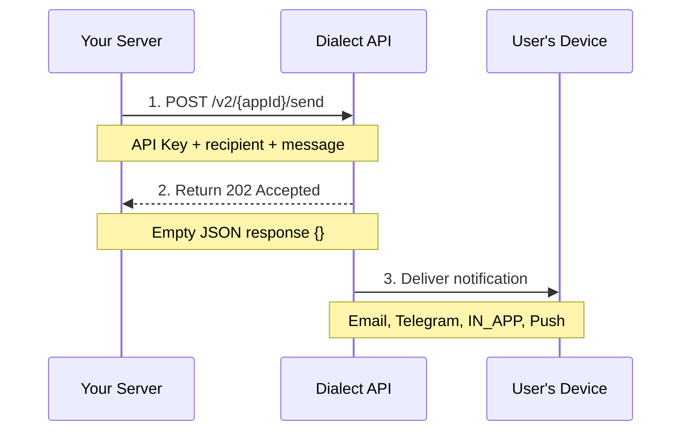

<Warning>
**Users must subscribe to your app before you can send them notifications.** If you try to send a message to an unsubscribed user, it will not be delivered.

**Setting up user subscriptions:** See our **[User Management guide](/alerts/integrate-inbox/user-management)** for implementation details.
</Warning>

## Prerequisites

Before sending messages, ensure you have completed these steps:

1. **Authentication Setup**: Have your API key ready (see the [Authentication guide](/alerts/send/api/authentication) if you need to set this up)
2. **App Registration**: Your app must be [registered](/alerts/setup/register-app) with Dialect
3. **User Subscriptions**: Ensure your users have [subscribed](/alerts/integrate-inbox/user-management) to receive notifications from your app

## Message Delivery Overview

Dialect's REST API provides flexible delivery options:

1. **Channel Selection**: Messages are sent according to user channel preferences (IN_APP, email, Telegram, push)
2. **User Targeting**: Send to individual users, groups, or broadcast to all subscribers
3. **Rich Content**: Support for titles, actions, images, and formatted content
4. **Topic-Based**: Optional targeting based on notification types/topics

## How It Works



## Step 1: Basic Message Sending

### Send to a Single User

Send a notification to a specific user's wallet address. This is the most common messaging pattern.

**API Reference:** [`POST /v2/{appId}/send`](https://alerts-api.dial.to/docs#tag/Application/POST/v2/%7BappId%7D/send)

<Tabs>
<Tab title="curl">
```bash
curl https://alerts-api.dial.to/v2/{appId}/send \
  --request POST \
  --header 'x-dialect-api-key: YOUR_API_KEY' \
  --header 'Content-Type: application/json' \
  --data '{
    "recipient": {
      "type": "subscriber",
      "walletAddress": "9WzDXwBbmkg8ZTbNMqUxvQRAyrZzDsGYdLVL9zYtAWWM"
    },
    "channels": ["EMAIL", "IN_APP"],
    "message": {
      "title": "Welcome to Our Platform! 🎉",
      "body": "Thanks for joining us. Get started by exploring our features."
    }
  }'
```
</Tab>
<Tab title="TypeScript">
```typescript
const message = {
  recipient: {
    type: 'subscriber',
    walletAddress: '9WzDXwBbmkg8ZTbNMqUxvQRAyrZzDsGYdLVL9zYtAWWM'
  },
  channels: ['EMAIL', 'IN_APP'],
  message: {
    title: 'Welcome to Our Platform! 🎉',
    body: 'Thanks for joining us. Get started by exploring our features.'
  }
};

const response = await fetch(`https://alerts-api.dial.to/v2/${appId}/send`, {
  method: 'POST',
  headers: {
    'x-dialect-api-key': 'YOUR_API_KEY',
    'Content-Type': 'application/json'
  },
  body: JSON.stringify(message)
});

const result = await response.json();
```
</Tab>
</Tabs>

### Send to Multiple Users

Send the same notification to multiple specific users in a single request. This is more efficient than making individual API calls and supports up to 10,000 wallet addresses.

**API Reference:** [`POST /v2/{appId}/send`](https://alerts-api.dial.to/docs#tag/Application/POST/v2/%7BappId%7D/send)

<Tabs>
<Tab title="curl">
```bash
curl https://alerts-api.dial.to/v2/{appId}/send \
  --request POST \
  --header 'x-dialect-api-key: YOUR_API_KEY' \
  --header 'Content-Type: application/json' \
  --data '{
    "recipient": {
      "type": "subscribers",
      "walletAddresses": [
        "9WzDXwBbmkg8ZTbNMqUxvQRAyrZzDsGYdLVL9zYtAWWM",
        "AnotherWalletAddress123...",
        "ThirdWalletAddress456..."
      ]
    },
    "channels": ["EMAIL", "IN_APP"],
    "message": {
      "title": "Welcome to Our Platform! 🎉",
      "body": "Thanks for joining us. Get started by exploring our features."
    }
  }'
```
</Tab>
<Tab title="TypeScript">
```typescript
const users = [
  '9WzDXwBbmkg8ZTbNMqUxvQRAyrZzDsGYdLVL9zYtAWWM',
  'AnotherWalletAddress123...',
  'ThirdWalletAddress456...'
];

const multipleUsersMessage = {
  recipient: {
    type: 'subscribers',
    walletAddresses: users
  },
  channels: ['EMAIL', 'IN_APP'],
  message: {
    title: 'Welcome to Our Platform! 🎉',
    body: 'Thanks for joining us. Get started by exploring our features.'
  }
};

const response = await fetch(`https://alerts-api.dial.to/v2/${appId}/send`, {
  method: 'POST',
  headers: {
    'x-dialect-api-key': 'YOUR_API_KEY',
    'Content-Type': 'application/json'
  },
  body: JSON.stringify(multipleUsersMessage)
});
```
</Tab>
</Tabs>

### Broadcast to All Users

Send notifications to all users subscribed to your app by using the `all-subscribers` recipient type.

<Tabs>
<Tab title="curl">
```bash
curl https://alerts-api.dial.to/v2/{appId}/send \
  --request POST \
  --header 'x-dialect-api-key: YOUR_API_KEY' \
  --header 'Content-Type: application/json' \
  --data '{
    "recipient": {
      "type": "all-subscribers"
    },
    "channels": ["EMAIL", "IN_APP"],
    "message": {
      "title": "Major Update Released! 🚀",
      "body": "Version 2.0 is now live with exciting new features."
    }
  }'
```
</Tab>
<Tab title="TypeScript">
```typescript
const broadcastMessage = {
  recipient: {
    type: 'all-subscribers'
  },
  channels: ['EMAIL', 'IN_APP'],
  message: {
    title: 'Major Update Released! 🚀',
    body: 'Version 2.0 is now live with exciting new features.'
  }
};

const response = await fetch(`https://alerts-api.dial.to/v2/${appId}/send`, {
  method: 'POST',
  headers: {
    'x-dialect-api-key': 'YOUR_API_KEY',
    'Content-Type': 'application/json'
  },
  body: JSON.stringify(broadcastMessage)
});
```
</Tab>
</Tabs>

### Send Personalized Messages to Multiple Users

Send **different** notification content to multiple users using the batch endpoint. This is ideal for personalized alerts like individual portfolio updates, transaction confirmations, or customized recommendations. Supports up to 500 personalized messages per batch.

**API Reference:** [`POST /v2/{appId}/send-batch`](https://alerts-api.dial.to/docs#tag/Application/POST/v2/%7BappId%7D/send-batch)

<Tabs>
<Tab title="curl">
```bash
curl https://alerts-api.dial.to/v2/{appId}/send-batch \
  --request POST \
  --header 'x-dialect-api-key: YOUR_API_KEY' \
  --header 'Content-Type: application/json' \
  --data '{
    "alerts": [
      {
        "recipient": {
          "type": "subscriber",
          "walletAddress": "9WzDXwBbmkg8ZTbNMqUxvQRAyrZzDsGYdLVL9zYtAWWM"
        },
        "channels": ["EMAIL", "IN_APP"],
        "message": {
          "title": "Your SOL Staking Rewards: 0.15 SOL Earned! 🎯",
          "body": "Great news! Your staked SOL has earned 0.15 SOL in rewards this week. Your total staked amount is now 12.5 SOL with an APY of 6.8%."
        }
      },
      {
        "recipient": {
          "type": "subscriber",
          "walletAddress": "AnotherWalletAddress123..."
        },
        "channels": ["EMAIL", "IN_APP"],
        "message": {
          "title": "Your USDC Position is Up 2.3% Today! 📈",
          "body": "Your USDC lending position has gained $45.80 today. Current balance: $2,045.80. Consider increasing your position while rates are favorable."
        }
      },
      {
        "recipient": {
          "type": "subscriber",
          "walletAddress": "ThirdWalletAddress456..."
        },
        "channels": ["EMAIL", "IN_APP"],
        "message": {
          "title": "Portfolio Weekly Summary: +$450 Gain 🚀",
          "body": "Your portfolio performed excellently this week with a total gain of $450 (12.3%). Top performer: Jupiter (JUP) +34%. Review your full analysis."
        }
      }
    ]
  }'
```
</Tab>
<Tab title="TypeScript">
```typescript
// Example: Portfolio performance alerts with personalized data
const portfolioAlerts = [
  {
    walletAddress: '9WzDXwBbmkg8ZTbNMqUxvQRAyrZzDsGYdLVL9zYtAWWM',
    rewards: 0.15,
    totalStaked: 12.5,
    apy: 6.8
  },
  {
    walletAddress: 'AnotherWalletAddress123...',
    usdcGain: 45.80,
    currentBalance: 2045.80,
    assetType: 'USDC Lending'
  },
  {
    walletAddress: 'ThirdWalletAddress456...',
    weeklyGain: 450,
    gainPercentage: 12.3,
    topPerformer: 'Jupiter (JUP)',
    topPerformance: 34
  }
];

const batchPersonalizedAlerts = {
  alerts: portfolioAlerts.map(user => ({
    recipient: {
      type: 'subscriber',
      walletAddress: user.walletAddress
    },
    channels: ['EMAIL', 'IN_APP'],
    message: {
      title: user.rewards 
        ? `Your SOL Staking Rewards: ${user.rewards} SOL Earned! 🎯`
        : user.usdcGain 
        ? `Your ${user.assetType} is Up ${((user.usdcGain / (user.currentBalance - user.usdcGain)) * 100).toFixed(1)}% Today! 📈`
        : `Portfolio Weekly Summary: +$${user.weeklyGain} Gain 🚀`,
      
      body: user.rewards
        ? `Great news! Your staked SOL has earned ${user.rewards} SOL in rewards this week. Your total staked amount is now ${user.totalStaked} SOL with an APY of ${user.apy}%.`
        : user.usdcGain
        ? `Your ${user.assetType} position has gained $${user.usdcGain} today. Current balance: $${user.currentBalance}. Consider increasing your position while rates are favorable.`
        : `Your portfolio performed excellently this week with a total gain of $${user.weeklyGain} (${user.gainPercentage}%). Top performer: ${user.topPerformer} +${user.topPerformance}%. Review your full analysis.`
    }
  }))
};

const response = await fetch(`https://alerts-api.dial.to/v2/${appId}/send-batch`, {
  method: 'POST',
  headers: {
    'x-dialect-api-key': 'YOUR_API_KEY',
    'Content-Type': 'application/json'
  },
  body: JSON.stringify(batchPersonalizedAlerts)
});
```
</Tab>
</Tabs>

<Note>
**When to use send-batch vs send:**
- **Use `/send` with `"subscribers"` type** when sending the **same message** to multiple users (up to 10,000)
- **Use `/send-batch`** when sending **different personalized content** to multiple users (up to 500)
</Note>

## Step 2: Channel-Specific Delivery

### Target Email and Telegram

Control which channels receive your message by specifying the `channels` array. Note that IN_APP notifications are delivered automatically when included, so you can add other channels as needed.

<Tabs>
<Tab title="curl">
```bash
curl https://alerts-api.dial.to/v2/{appId}/send \
  --request POST \
  --header 'x-dialect-api-key: YOUR_API_KEY' \
  --header 'Content-Type: application/json' \
  --data '{
    "recipient": {
      "type": "subscriber",
      "walletAddress": "9WzDXwBbmkg8ZTbNMqUxvQRAyrZzDsGYdLVL9zYtAWWM"
    },
    "channels": ["EMAIL", "TELEGRAM"],
    "message": {
      "title": "Weekly Portfolio Summary",
      "body": "Here is your portfolio performance for this week..."
    }
  }'
```
</Tab>
<Tab title="TypeScript">
```typescript
const weeklyUpdate = {
  recipient: {
    type: 'subscriber',
    walletAddress: '9WzDXwBbmkg8ZTbNMqUxvQRAyrZzDsGYdLVL9zYtAWWM'
  },
  channels: ['EMAIL', 'TELEGRAM'],
  message: {
    title: 'Weekly Portfolio Summary',
    body: 'Here is your portfolio performance for this week...'
  }
};

await fetch(`https://alerts-api.dial.to/v2/${appId}/send`, {
  method: 'POST',
  headers: {
    'x-dialect-api-key': 'YOUR_API_KEY',
    'Content-Type': 'application/json'
  },
  body: JSON.stringify(weeklyUpdate)
});
```
</Tab>
</Tabs>

### Rich HTML Content for Email

When sending to email channels, you can use HTML formatting for rich content presentation.

<Tabs>
<Tab title="curl">
```bash
curl https://alerts-api.dial.to/v2/{appId}/send \
  --request POST \
  --header 'x-dialect-api-key: YOUR_API_KEY' \
  --header 'Content-Type: application/json' \
  --data '{
    "recipient": {
      "type": "subscriber",
      "walletAddress": "9WzDXwBbmkg8ZTbNMqUxvQRAyrZzDsGYdLVL9zYtAWWM"
    },
    "channels": ["EMAIL"],
    "message": {
      "title": "Transaction Confirmation - Order #12345",
      "body": "<h2>Transaction Successful</h2><p>Your transaction has been processed successfully.</p><table style=\"width: 100%; border-collapse: collapse;\"><tr><td style=\"padding: 10px; border: 1px solid #ddd;\"><strong>Amount:</strong></td><td style=\"padding: 10px; border: 1px solid #ddd;\">0.5 SOL</td></tr><tr><td style=\"padding: 10px; border: 1px solid #ddd;\"><strong>Fee:</strong></td><td style=\"padding: 10px; border: 1px solid #ddd;\">0.0025 SOL</td></tr><tr><td style=\"padding: 10px; border: 1px solid #ddd;\"><strong>Transaction ID:</strong></td><td style=\"padding: 10px; border: 1px solid #ddd;\">3x7Kj...9mNp</td></tr></table><p>View full details in your dashboard.</p>"
    }
  }'
```
</Tab>
<Tab title="TypeScript">
```typescript
const emailNotification = {
  recipient: {
    type: 'subscriber',
    walletAddress: '9WzDXwBbmkg8ZTbNMqUxvQRAyrZzDsGYdLVL9zYtAWWM'
  },
  channels: ['EMAIL'],
  message: {
    title: 'Transaction Confirmation - Order #12345',
    body: `
      <h2>Transaction Successful</h2>
      <p>Your transaction has been processed successfully.</p>
      
      <table style="width: 100%; border-collapse: collapse;">
        <tr>
          <td style="padding: 10px; border: 1px solid #ddd;"><strong>Amount:</strong></td>
          <td style="padding: 10px; border: 1px solid #ddd;">0.5 SOL</td>
        </tr>
        <tr>
          <td style="padding: 10px; border: 1px solid #ddd;"><strong>Fee:</strong></td>
          <td style="padding: 10px; border: 1px solid #ddd;">0.0025 SOL</td>
        </tr>
        <tr>
          <td style="padding: 10px; border: 1px solid #ddd;"><strong>Transaction ID:</strong></td>
          <td style="padding: 10px; border: 1px solid #ddd;">3x7Kj...9mNp</td>
        </tr>
      </table>
      
      <p>View full details in your dashboard.</p>
    `
  }
};

await fetch(`https://alerts-api.dial.to/v2/${appId}/send`, {
  method: 'POST',
  headers: {
    'x-dialect-api-key': 'YOUR_API_KEY',
    'Content-Type': 'application/json'
  },
  body: JSON.stringify(emailNotification)
});
```
</Tab>
</Tabs>

## Step 3: Interactive & Rich Messages

### Actionable Notifications

Add action buttons to your notifications that allow users to take immediate action. Currently supports up to 3 action buttons that can direct users to websites.

<Tabs>
<Tab title="curl">
```bash
curl https://alerts-api.dial.to/v2/{appId}/send \
  --request POST \
  --header 'x-dialect-api-key: YOUR_API_KEY' \
  --header 'Content-Type: application/json' \
  --data '{
    "recipient": {
      "type": "subscriber",
      "walletAddress": "9WzDXwBbmkg8ZTbNMqUxvQRAyrZzDsGYdLVL9zYtAWWM"
    },
    "channels": ["EMAIL", "IN_APP"],
    "message": {
      "title": "Staking Rewards Ready! 🎯",
      "body": "You have earned 0.15 SOL in staking rewards. Click below to claim them.",
      "actions": [
        {
          "type": "link",
          "label": "Claim Rewards",
          "url": "https://yourapp.com/claim-rewards"
        }
      ]
    }
  }'
```
</Tab>
<Tab title="TypeScript">
```typescript
const rewardNotification = {
  recipient: {
    type: 'subscriber',
    walletAddress: '9WzDXwBbmkg8ZTbNMqUxvQRAyrZzDsGYdLVL9zYtAWWM'
  },
  channels: ['EMAIL', 'IN_APP'],
  message: {
    title: 'Staking Rewards Ready! 🎯',
    body: 'You have earned 0.15 SOL in staking rewards. Click below to claim them.',
    actions: [
      {
        type: 'link',
        label: 'Claim Rewards',
        url: 'https://yourapp.com/claim-rewards'
      }
    ]
  }
};

await fetch(`https://alerts-api.dial.to/v2/${appId}/send`, {
  method: 'POST',
  headers: {
    'x-dialect-api-key': 'YOUR_API_KEY',
    'Content-Type': 'application/json'
  },
  body: JSON.stringify(rewardNotification)
});
```
</Tab>
</Tabs>

### Messages with Images

Include images in your notifications using publicly accessible URLs. Images are supported for IN_APP and EMAIL channels.

<Tabs>
<Tab title="curl">
```bash
curl https://alerts-api.dial.to/v2/{appId}/send \
  --request POST \
  --header 'x-dialect-api-key: YOUR_API_KEY' \
  --header 'Content-Type: application/json' \
  --data '{
    "recipient": {
      "type": "all-subscribers"
    },
    "channels": ["IN_APP", "EMAIL"],
    "message": {
      "title": "New Feature Announcement 🎉",
      "body": "Check out our latest feature that will revolutionize your workflow!",
      "image": "https://yourapp.com/images/feature-preview.png",
      "actions": [
        {
          "type": "link",
          "label": "Try New Feature",
          "url": "https://yourapp.com/new-feature"
        }
      ]
    }
  }'
```
</Tab>
<Tab title="TypeScript">
```typescript
const featureAnnouncement = {
  recipient: {
    type: 'all-subscribers'
  },
  channels: ['IN_APP', 'EMAIL'],
  message: {
    title: 'New Feature Announcement 🎉',
    body: 'Check out our latest feature that will revolutionize your workflow!',
    image: 'https://yourapp.com/images/feature-preview.png',
    actions: [
      {
        type: 'link',
        label: 'Try New Feature',
        url: 'https://yourapp.com/new-feature'
      }
    ]
  }
};

await fetch(`https://alerts-api.dial.to/v2/${appId}/send`, {
  method: 'POST',
  headers: {
    'x-dialect-api-key': 'YOUR_API_KEY',
    'Content-Type': 'application/json'
  },
  body: JSON.stringify(featureAnnouncement)
});
```
</Tab>
</Tabs>

## Step 4: Topic-Based Messaging

### Send to Topic Subscribers

If you've configured notification topics, you can send targeted messages to users who have subscribed to specific categories.

<Tabs>
<Tab title="curl">
```bash
curl https://alerts-api.dial.to/v2/{appId}/send \
  --request POST \
  --header 'x-dialect-api-key: YOUR_API_KEY' \
  --header 'Content-Type: application/json' \
  --data '{
    "recipient": {
      "type": "all-subscribers"
    },
    "channels": ["EMAIL", "IN_APP"],
    "message": {
      "title": "🗳️ New Governance Proposal: Protocol Upgrade",
      "body": "A new governance proposal is now live for voting. Your participation matters for the future of our protocol."
    },
    "topicId": "governance-updates"
  }'
```
</Tab>
<Tab title="TypeScript">
```typescript
const governanceUpdate = {
  recipient: {
    type: 'all-subscribers'
  },
  channels: ['EMAIL', 'IN_APP'],
  message: {
    title: '🗳️ New Governance Proposal: Protocol Upgrade',
    body: 'A new governance proposal is now live for voting. Your participation matters for the future of our protocol.'
  },
  topicId: 'governance-updates'
};

await fetch(`https://alerts-api.dial.to/v2/${appId}/send`, {
  method: 'POST',
  headers: {
    'x-dialect-api-key': 'YOUR_API_KEY',
    'Content-Type': 'application/json'
  },
  body: JSON.stringify(governanceUpdate)
});
```
</Tab>
</Tabs>

## Step 5: Advanced Operations

### Get Your Subscribers

Retrieve a list of all wallet addresses currently subscribed to your application:

**API Reference:** [`GET /v2/{appId}/subscribers`](https://alerts-api.dial.to/docs#tag/Application/GET/v2/%7BappId%7D/subscribers)

<Tabs>
<Tab title="curl">
```bash
curl https://alerts-api.dial.to/v2/{appId}/subscribers \
  --request GET \
  --header 'x-dialect-api-key: YOUR_API_KEY'
```
</Tab>
<Tab title="TypeScript">
```typescript
const response = await fetch(`https://alerts-api.dial.to/v2/${appId}/subscribers`, {
  method: 'GET',
  headers: {
    'x-dialect-api-key': 'YOUR_API_KEY'
  }
});

const { subscribers } = await response.json();
// subscribers: [{ walletAddress: "..." }, { walletAddress: "..." }]
```
</Tab>
</Tabs>

**Optional Parameters:**
- `offset`: Pagination offset (default: 0)
- `limit`: Pagination limit (default: 1000, max: 10000)

<Tabs>
<Tab title="curl">
```bash
# With pagination
curl "https://alerts-api.dial.to/v2/{appId}/subscribers?offset=100&limit=50" \
  --request GET \
  --header 'x-dialect-api-key: YOUR_API_KEY'
```
</Tab>
<Tab title="TypeScript">
```typescript
const response = await fetch(`https://alerts-api.dial.to/v2/${appId}/subscribers?offset=100&limit=50`, {
  method: 'GET',
  headers: {
    'x-dialect-api-key': 'YOUR_API_KEY'
  }
});

const { subscribers } = await response.json();
```
</Tab>
</Tabs>

## Message Examples by Use Case

### Welcome Message
```typescript
const welcomeMessage = {
  recipient: {
    type: 'subscriber',
    walletAddress: userWallet
  },
  channels: ['EMAIL', 'IN_APP'],
  message: {
    title: 'Welcome to [Your App]! 🎉',
    body: 'Thanks for subscribing! You will now receive important updates and alerts.',
    actions: [
      { 
        type: 'link', 
        label: 'Get Started', 
        url: 'https://yourapp.com/onboarding' 
      }
    ]
  }
};
```

### Transaction Alert
```typescript
const transactionAlert = {
  recipient: {
    type: 'subscriber',
    walletAddress: userWallet
  },
  channels: ['IN_APP', 'EMAIL'],
  message: {
    title: 'Transaction Confirmed ✅',
    body: 'Your 0.5 SOL transfer to 3x7Kj...9mNp has been confirmed.'
  }
};
```

### Security Alert
```typescript
const securityAlert = {
  recipient: {
    type: 'subscriber',
    walletAddress: userWallet
  },
  channels: ['EMAIL', 'IN_APP'],
  message: {
    title: '🔒 Security Alert: New Login Detected',
    body: 'A new login to your account was detected from a new device. If this was not you, please secure your account immediately.',
    actions: [
      { 
        type: 'link', 
        label: 'Review Security', 
        url: 'https://yourapp.com/security' 
      }
    ]
  }
};
```

### Price Alert
```typescript
const priceAlert = {
  recipient: {
    type: 'subscriber',
    walletAddress: userWallet
  },
  channels: ['IN_APP'],
  message: {
    title: '📈 Price Alert: SOL +12%',
    body: 'Solana is up 12% in the last hour, now trading at $145. Your portfolio value has increased by $340.',
    actions: [
      { 
        type: 'link', 
        label: 'View Portfolio', 
        url: 'https://yourapp.com/portfolio' 
      }
    ]
  },
  topicId: 'price-alerts'
};
```

## Error Handling

### Common Response Codes

**202 Accepted**: Message sent successfully
```json
{}
```

**400 Bad Request**: Invalid request format
```json
{
  "error": {
    "message": "Validation failed",
    "details": "Title is required"
  }
}
```

**401 Unauthorized**: Invalid API key
```json
{
  "error": "Unauthorized"
}
```

**403 Forbidden**: Access denied
```json
{
  "error": "Forbidden"
}
```

### Error Handling Example

```typescript
async function sendNotificationSafely(appId: string, apiKey: string, message: any) {
  try {
    const response = await fetch(`https://alerts-api.dial.to/v2/${appId}/send`, {
      method: 'POST',
      headers: {
        'x-dialect-api-key': apiKey,
        'Content-Type': 'application/json'
      },
      body: JSON.stringify(message)
    });

    if (!response.ok) {
      const error = await response.json();
      throw new Error(`HTTP ${response.status}: ${JSON.stringify(error)}`);
    }

    console.log('✅ Message sent successfully');
    return { success: true };

  } catch (error) {
    console.error('❌ Message sending failed:', error);
    
    if (error.message.includes('401')) {
      return { 
        success: false, 
        error: 'Invalid API key',
        code: 'UNAUTHORIZED'
      };
    } else if (error.message.includes('400')) {
      return { 
        success: false, 
        error: 'Invalid request format',
        code: 'BAD_REQUEST'
      };
    } else {
      return { 
        success: false, 
        error: 'Unknown error occurred',
        code: 'UNKNOWN_ERROR'
      };
    }
  }
}
```

## Best Practices

💡 **Message Design Tips**:
- Keep titles concise and descriptive (especially important for email subjects)
- Structure longer messages with clear sections
- Always include clear calls-to-action when appropriate
- Use HTML formatting only for email channels

💡 **Technical Tips**:
- Test your messages across different channels (IN_APP vs email vs Telegram)
- Implement proper error handling and retry logic for critical notifications
- Use batch sending for multiple recipients to improve efficiency
- Consider user time zones when sending time-sensitive notifications

💡 **User Experience Tips**:
- Respect user preferences and subscription settings
- Provide context in your messages - users should understand why they're receiving the notification
- Use topic-based messaging to ensure relevance
- Make action buttons clear and valuable