## Overview

Dialect's notification system is built around three fundamental concepts that work together to create flexible, scalable notification experiences.

### How It All Works Together

```mermaid
flowchart LR
    User[👤 User] --> Subscribe[Subscribe to Topics]
    Subscribe --> Choose[Choose Channels]
    Choose --> Receive[📱 Receive Notifications]
    
    App[🏗️ Your App] --> Send[Send to Topics]
    Send --> Deliver[📮 Dialect Delivers]
    Deliver --> Receive
    
    style User fill:#e8f5e8
    style App fill:#e1f5fe
    style Receive fill:#f3e5f5
```

### The Flow
1. **Users subscribe** to topics they care about and choose how they want to be notified
2. **Your app sends** notifications to relevant topics when events happen  
3. **Dialect delivers** those notifications to subscribers via their chosen channels

## Topics

**Topics** define *what* notifications are about. They categorize and organize different types of alerts your application sends.

### What are Topics?

Think of topics as notification categories or event types:
- **Price Alerts** - Token price changes
- **Liquidation Warnings** - DeFi position risks  
- **Governance Updates** - DAO proposal notifications
- **NFT Activity** - New offers and auction alerts

### Topic Best Practices

**1. Granular but not overwhelming**

Choose topics that are specific enough to be actionable but not so granular that they become overwhelming.

Good examples:
- Liquidation warnings for critical DeFi alerts
- Price target notifications when thresholds are met
- Governance proposals for DAO updates
- Yield changes for APY updates

Avoid:
- "Everything" - Too broad and not actionable
- "BTC price up 1%" - Too specific and noisy

**2. Clear naming**

Use clear, descriptive names that users can easily understand.

Good examples:
- "Order Shipped" 
- "Payment Received"
- "Security Alert"

Avoid technical jargon like:
- "tx-confirmed-evt"
- "usr-auth-req"

**3. User-focused descriptions**

Write descriptions that focus on user benefits rather than technical details.

Good example:
"Get alerted before your DeFi positions are at risk of liquidation"

Instead of:
"Automated liquidation risk calculation notifications"

## Channels

**Channels** define *how* notifications are delivered to users. Each channel represents a different communication method.

### Available Channels

| Channel | Description | Content Support | Best For |
|---------|-------------|-----------------|----------|
| **EMAIL** | Email notifications | HTML formatting, rich content | Detailed updates, newsletters, reports |
| **TELEGRAM** | Telegram bot messages | Text only, no images | Real-time alerts, simple notifications |
| **IN_APP** | In-application notifications | Text + single image (1:1 ratio) | User engagement, visual notifications |
| **PUSH** | Mobile push notifications | Text only | Critical mobile alerts (app owners only) |

### Channel Characteristics

**EMAIL**
- **Content**: Full HTML support with rich formatting
- **Character Limit**: 4,096 characters
- **Images**: Via HTML `` tags (not file uploads)
- **Delivery**: Reliable but not immediate (few minutes)
- **Best for**: Detailed notifications, newsletters, formatted content

**TELEGRAM** 
- **Content**: Text only, no image support
- **Character Limit**: 4,096 characters  
- **Links**: Supported with inline buttons
- **Delivery**: Near real-time
- **Best for**: Quick alerts, simple notifications, community updates

**IN_APP**
- **Content**: Plain text + optional single image
- **Character Limit**: 800 characters
- **Images**: 1:1 aspect ratio, 100KB maximum
- **Display**: Shows in notification bell component
- **Delivery**: Real-time when user is active
- **Best for**: Visual notifications, feature announcements, user engagement

**PUSH** (App Owners Only)
- **Content**: Text only
- **Character Limit**: Varies by platform (iOS ~200, Android ~250)
- **Delivery**: Mobile notifications
- **Restriction**: Only available to app owners for their own users
- **Best for**: Critical alerts, time-sensitive information

## Subscribers

**Subscribers** represent *who* receives notifications. Each subscriber is a user who has opted in to receive alerts from your application.

### Subscription Methods

There are three ways to subscribe users to notifications:

1. **React Widget**: Users can subscribe by clicking the notification bell and signing a message to verify their wallet ownership. This is the simplest way to get started and works well for most dapps. For more information checkout our [quickstart section](/alerts/quick-start#step-4-user-subscribes-to-notifications-2-minutes).

2. **API Integration**: For wallet applications that can sign messages on behalf of users, we recommend using our API to programmatically subscribe users. This provides more control over the subscription flow and a smoother user experience.

3. **SDK Integration**: Use our TypeScript/JavaScript SDK to programmatically manage subscriptions from your backend or frontend applications. This approach offers the most flexibility and is ideal for custom subscription flows and backend integrations. Learn more in our [SDK documentation](/alerts/integrate-inbox/sdk).

## Next Steps

Now that you understand the core concepts:

1. **[Dashboard introduction](dashboard-introduction)** - Learn to manage topics and subscribers
2. **[Send your first alert](/alerts/send)** - Start sending notifications to subscribers
3. **[Integrate a Universal Inbox](/alerts/integrate-inbox/universal-inbox)** - Receive alerts in your app